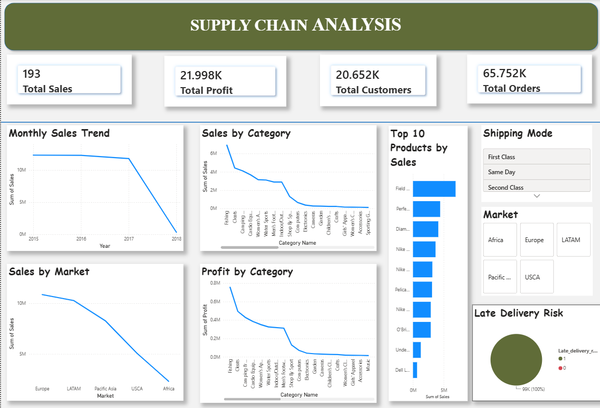

# 📦 Supply Chain Analytics

## 📖 Project Overview

This project analyzes a real-world supply chain dataset using **Python**, **SQL**, and **Power BI**. The goal is to clean the data, perform exploratory data analysis (EDA), answer business questions using SQL, and create an interactive dashboard for business insights.

---

## 🎯 Problem Statement

Supply chain companies generate large amounts of data related to customers, products, sales, and shipping. Analyzing this data helps businesses identify sales trends, improve delivery performance, understand customer behavior, and make better business decisions.

---

## 🎯 Business Objectives

This project aims to:

- Analyze sales performance across different regions.
- Identify high-performing product categories.
- Evaluate shipping efficiency and delivery risks.
- Understand customer purchasing behavior.
- Build an interactive dashboard for business decision-making.

---

## 🛠️ Tools & Technologies

- Python
- Pandas
- Matplotlib
- PostgreSQL
- Power BI
- Jupyter Notebook
- GitHub

---

## 📂 Project Structure

```
Supply_Chain_Analytics/
│
├── Dataset/
├── Python/
├── Sql/
├── PowerBI/
├── Images/
├── Report/
├── README.md
└── LICENSE
```

---

## 📂 Dataset

**Source:** DataCo Smart Supply Chain Dataset (Kaggle)

**Format:** CSV

The dataset contains information on:

- Customers
- Products
- Orders
- Shipping
- Sales
- Delivery Status

---

## 📊 Dashboard

The interactive Power BI dashboard includes:

- Sales Overview
- Regional Sales Analysis
- Product Category Performance
- Customer Insights
- Delivery Status Analysis
- Late Delivery Risk
- Interactive Filters and KPIs



---

## 🚀 Skills Demonstrated

- Data Cleaning
- Exploratory Data Analysis (EDA)
- SQL Query Writing
- Business Intelligence
- Dashboard Development
- Data Visualization
- Business Analytics

---

## 📈 Key Insights

- Europe generated the highest sales.
- Fishing was the highest-selling category.
- Top products contributed significantly to total sales.
- Sales varied across different months.
- Shipping mode influenced delivery performance.
- Many orders had a late delivery risk.

---

## 📌 Project Workflow

1. Data Cleaning using Python
2. Exploratory Data Analysis (EDA)
3. SQL Business Queries
4. Power BI Dashboard Creation
5. Business Insights

---

## 📌 Project Results

- Cleaned and prepared supply chain data using Python.
- Performed SQL-based business analysis.
- Built an interactive Power BI dashboard.
- Identified key sales trends, delivery risks, and customer insights to support business decision-making.

---

## 🚀 Future Improvements

- Sales Forecasting
- Customer Segmentation
- Delivery Prediction
- Advanced Power BI Dashboard

---

## 👩‍💻 Author

**Mrunal Shinde**


